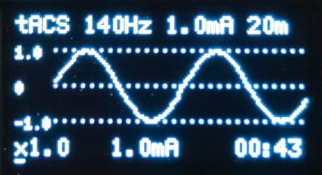
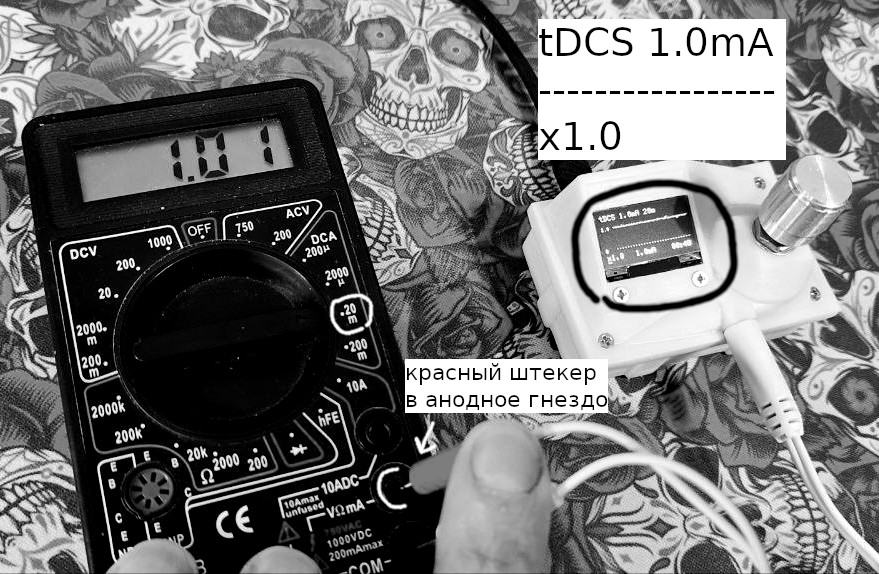

# Инструкция к DIY tRNS v0.9.0

DIY tRNS - устройство для немедицинского использования, источник малых токов, идентичных по форме tDCS/tRNS/tACS. Для достижения наилучших результатов требуется ответственный подход к процессу стимуляции, строго следуйте рекомендациям по монтажам и проведению сеансов из надежных источников. Для медицинских задач обращайтесь к медицинским специалистам. Не сочетайте стимуляцию с препаратами без прямой рекомендации медицинского специалиста, т.е. при самостоятельных практиках не сочетайте никогда.

## Меры безопасности

* Используйте аппарат строго по назначению согласно протоколам, опирающимся на качественные источники, важен монтаж и размер электродов (комплектные 5x5см считаются безопасными для DIY применения, если в публикации площадь меньше, то можно меньше, в комплекте есть анод малой площади), сила тока (например, 1мА), частота и продолжительность сеанса (например, по 20 минут каждый день или через день), продолжительность курса (например, 5-10 дней) и частота курсов (например, 2-4 раза в год).
* Отслеживайте ток во время сеанса на мониторе, если он более чем на 15%-20% выше выставленного в настройках, вероятно, устройство неисправно, немедленно прекратите сеанс. Если ток значительно ниже ожидаемого, то это нормально только в фазах плавного старта/стопа, иначе, если на мониторе x1.0 (полная рабочая интенсивность), то следует проверить все соединения всех коннекторов электродов и качество контакта электродов на коже, возможно, устройству не хватает мощности (слишком большое сопротивление нагрузки для выставленного тока) или сел повербанк или устройство неисправно.
* Электроды во время сеанса должны быть со смоченными электролитом (солёной водой или специальным гелем) губками, сам прибор следует беречь от попадания электролита или воды внутрь. Следите, чтобы капли не стекали по кабелю электрода в гнездо, чтобы гнездо было выше нижней точки кабеля. Пользуйтесь устройством с сухими руками.
* Избегайте монтажа электродов на родинках или повреждениях кожи или слишком близко к ним.
* Если вы чувствуйте сильное жжение или другой острый дискомфорт, немедленно прекратите сеанс выдергиванием кабеля питания или электродов с головы или электродов из гнезда. Для tDCS небольшое показывание допустимо, но интенсивное может говорить о слишком большом токе, плохом контакте или неисправности устройства.
* Стимуляция tDCS/tRNS - высокоэффективный способ вмешательства в работу мозга с длительными сохраняющимися эффектами. Если вы замечаете негативные изменения в работе мозга, то лучшим решением будет прекратить сеанс и курс до выяснения причин.
* Если вы правша без серьезных медицинских ментальных расстройств, тиреотоксикоза, без  зависимостей и наличия медицинских имплантатов (зубные можно), то рисков негативного опыта стимуляции у вас меньше. В публикациях обычно пишут, какие группы лиц исключались из исследования, отнеситесь к этому максимально серьёзно.
* Берегите прибор от огня, воды, ударов и других экстремальных воздействий.

## Комплектация

1. DIY tRNS
2. Электродный кабель 2.35х0.7 с красным анодом со срезанным с наружнего контакта пластиковым кожухом, выходы - штыри 2 мм.
3. Электрод круглый анодовый 32мм с коннектором-гнездом 2мм.
4. 2-а электрода квадратных 50х50мм с коннектором-гнездом 2мм.
5. Губка поролоновая круглая.
6. 2-е губки квадратных.
7. Эластичная лента (удобна для монтожа электрода на лоб, например, на F3).
8. Эластичный бинт.
9. Инструкция.
9. USB повербанк нужен но его нет в комплекте.

## Поддерживаемые режимы и характеристики

1. tRNS - транскраниальная стимуляция шумовым током
- Амплитуда тока от 0.1мА до 2.0mA с шагом 0.1мА (по умолчанию 1мА). Это амплитуда, считается как 3 сигмы.
- Доступен только hf-tRNS режим 100-640Гц, как самый эффективный из хорошо изученных.
- Продолжительность сеанса от 1 до 60 минут.
2. tDCS - транскраниальная стимуляция постоян­ным током (в этом режиме полярность имеет критическое значение, при смене кабеля проверяйте полярность! см. "Калибровка DAC и проверка полярности")
- Рабочий ток от 0.1мА до 2.0mA с шагом 0.1мА (по умолчанию 1мА)
- Продолжительность сеанса от 1 до 60 минут. 
3. tACS - транскраниальная стимуляция постоян­ным током
- Рабочий ток от 0.1мА до 2.0mA с шагом 0.1мА (по умолчанию 1мА).
- Рабочая частота от 1 до 250 Гц с шагом в 1Гц (по умолчанию 140Гц).
- Продолжительность сеанса от 1 до 60 минут.
Для всех режимов общая настройка плавного пуска-стопа 1-60 секунд с шагом 1 секунда (по умолчанию 10) находится в настройках (см. "Меню и настройки")

## Интерфейсы устройства DIY tRNS

* Экран монохромный OLED.
* Энкодер с кнопкой - вращение для передвижения курсора или для изменения параметра, нажатие как на кнопку - выбор.
* Гнездо USB-C сзади корпуса для питания от повербанка или для подключения к компьютеру для перепрошивки.
* Гнездо DC-011 2.5х0.7 мм, подходит так же для кабеля 2.35х0.7 мм после срезания с кабеля пластикового кожуха, при замене кабеля с комплетного на другой проверяйте полярность (см. "Калибровка DAC и проверка полярности")!

## Подготовка к сеансу

Предполагается, что устройство откалибровано и полярность верная (полярность важна только для tDCS), это точно так, если вы не меняли, и не сбрасывали настройки, и не заменяли электродный кабель (в одной партии могут быть внешне совершенно идентичные кабели, но с противоположной полярностью, при комплектации я всё проверяю), в ином случае см. "Калибровка DAC и проверка полярности".

Приготовьте электролит. Смешайте половину чайной ложки соли с 350 мл воды. Этого хватит на весь курс в 5-10 дней, чтобы вода не выпаривалась, используйте тару с закрывающейся крышкой.

Подключите устройство к повербанку через USB-C. Выберите нужный режим стимуляции tDCS/tRNS/tACS, и установите параметры стимуляции: ток, продолжительность сеанса, для tACS ещё частота (см. "Меню и настройки"). 

Отклейте электроды от защитной плёнки (плёнки ещё пригодятся, электроды многоразовые) и к чёрной поверхности приложите губки, гель отлично приклеивается к сухой губке. Смочите губки электролитом, прямо окуните в тару и слегка отожмите лишнее, чтобы они были очень влажными, но с них не капало.

Наденьте повязки для удержания электродов в монтажных точках и подсуньте под них электроды мокрой губкой к коже. На коже в местах монтажа не должно быть повреждений и родинок.

Подключите электроды к кабелю, а кабель ко гнезду устройства.

Выберите и нажмите "СТАРТ", мгновенно или через полторы секунды (режим tACS чуть медленнее стартует) сеанс начнётся.

## Проведение сеанса

Совмещайте сеанс tDCS/tRNS с одновременным выполнением действий на развиваемый навык, это значительно усилит эффективность практики. После сеанса так же практикуйте целевой навык чаще, на протяжении всего курса и пары недель после него. Это позволит использовать усиленную сеансами нейропластичность для формирования полезных долговременных изменений. 

Во время сеанса рекомендуется поглядывать на монитор, там подробная информация о том, как протекает сеанс.



На экране отображаются:

1. Параметры пресета в верхней строке: тип "tDCS"/"hf-tRNS"/"tACS с частотой Hz", желаемый ток, желаемое время сеанса. 
2. Фактический ток через нагрузку в виде осциллограммы.
3. Множитель плавного пуска/стопа (шаблон xD.D в левом нижней углу), x1.0 означает, что рабочий фактический ток установился.
4. Сглаженный фактический ток - центр нижней строчки (вычисляется как амплитуда по действующему значению для tACS или по трём сигмам в tRNS или по среднему в окне для tDCS)
5. Текущее время от начала сеанса, как дойдёт до 19:50, то включится плавный стоп (если в настройках, см. "Меню и настройки", плавный стоп 10 секунд, можно менять) и в 20:00 (если выбрана продолжительность 20 минут) полностью завершится.
6. Нижняя линейка в пиксель толщиной - прогресс-бар сеанса, т.е. как п.5, только заполняемой шкалой.

Нормальные ощущения при tDCS - покалывания и зуд, если острая боль - то вы получаете ожог кожы, слишком высокая плотность тока, т.е. ток слишком большой и/или площать контакта электрода с кожей слишком маленькая. Могут быть вспышки - фосфены в глазах, если электроды близко к глазному нерву, чаще при tACS или при резкой смене качества контакта при tDCS. При использовании tRNS как правило дискомфорт минимальный, может не быть никаких ощущений кроме целевых.

При желании прервать сеанс досрочно, но плавно нажмите на энкодер во время сеанса, появится предложение продолжить или плавно завершить сеанс, при выборе плавного завершения сеанса вы вернётесь в окно сеанса и увидите как происходит его плавная остановка, множитель плавного пуска/стопа будет снижаться от x1.0 до x0.0 (по умолчанию 10 сек, чтобы поменять см. "Меню и настройки"), после чего сеанс завершится.

Сеанс завершится сам по таймеру (с плавным стопом на последних секундах), если не будет прерван досрочно.

## Действия после сеанса

Снимите повязку/бинты и электроды с головы или/и плеча.

Промойте электроды с губками водой и отклейте губки, от мокрой губки электрод легко отделяется.

Отожмите губки а электродам дайте подсохнуть черный слоем вверх минут 10-15, а потом наклейте на них защитные плёнки.

## Меню и настройки

Настройки и калибровки запоминаются в долговременной памяти устройства. Но могут слетать при перепрошивке.
```
Главное меню
> tRNS 
  tDCS 
  tACS 
  Настройки
```
Курсор "`>`" перемещается вращением ручки энкодера, нажатием на него совершается выбор раздела меню.

При выборе `tRNS` из `Главного меню`:
```
tRNS
> СТАРТ
  Амплитуда: 1.0мА
  Длительность: 20м
  <-Назад
```

* `СТАРТ` запускает сеанс, см. "Проведение сеанса"
* `Амплитуда: X.XмА` устанавливает желаемую амплитуду тока сеанса
* `Длительность: XXм` устанавливает желаемую длительность сеанса в минутах
* `<-Назад` возвращает в `Главное меню`

При выборе `tDCS` из `Главного меню`:
```
tDCS
> СТАРТ
  Ток: 1.0мА
  Длительность: 20м
  <-Назад
```
Пункты аналогичны описанным выше для `tRNS` только вместо амплитуды просто сила постоянного тока `Ток: X.XмА`

При выборе `tACS` из `Главного меню`:
```
tACS
> СТАРТ
  Амплитуда: 1.0мА
  Частота: 140Гц
  Длительность: 20м
  <-Назад
```
* `Частота: XXXГц` устанавливает желаемую частоту гармоники (синусоиды) тока сеанса tACS

Остальные пункты аналогичны описанным выше для `tRNS`

При выборе `Настройки` из `Главного меню`:
```
НАСТРОЙКИ
> <-Назад
  Энкодер: Инв.
  Полярность: Норм.
  DAC коды/мА: 11300
  Плавный пуск: 10s
  ADC mult: 1.00
  tRNS mult: 1.20
  СБРОС на заводские
  v0.9.0.20260215
  >>> ОБНОВЛЕНИЕ <<<
```

Все пункты полностью не помещаются в экран, потому тут есть листание и вертикальными стрелочками показано, есть ли ещё пункты за пределами показаных выше или ниже.

* `Энкодер: Инв. / Норм.` - нормальная настройка энкодера - по часовой стрелке курсор двигается вверх (или регулируемое число увеличивается), против часовой - вниз (или регулируемое число уменьшается), если у вас наоборот, нажмите на этот пункт, он поменяется на противоположный и станет работать правильно.
* `Полярность: Инв. / Норм.` - критична только для tDCS, см. "Калибровка DAC и проверка полярности", если на вашем электродном кабеле она нарушена нажмите на этот пункт и она программно перевернётся.
* `DAC коды/мА: XXXXX` - сколько единиц, пропорциональных напряжению должен выдавать DAC, чтобы получить 1мA целевого тока, см. "Калибровка DAC и проверка полярности", на нижней крышке написано нужное число (например, `DAC: 11300`), если у вас нет возможности/желания калибровать, а настройки по какой-то причине слетели, например, на заводские, то выставьте значение с нижней крышки.
* `Плавный пуск: XXs` - сколько секунд должно приходиться на плавный старт в начале сеанса и плавный стоп в конце.
* `ADC mult: X.XX` - калибровочный множитель "показометра" тока в центре нижней строки и осциллограммы на экране в режиме сеанса см. "Проведение сеанса". Если начал сильно врать, то, возможно это связано с сильным перепадом температур, всё настраивалось под комнатную. У меня на всех устройствах пока показывало точно, добавил на всякий случай.
* `СБРОС на заводские` - пользуйтесь аккуратно, сбрасывает все настройки на настройки по умолчанию, если что, `DAC коды/мА` написано на нижней крышке, а если энкодер стал работать наоборот, нажмите на `Энкодер: Инв. / Норм.`, кроме того, проверьте полярность перед использованием tDCS (см. Калибровка DAC и проверка полярности).
* `v0.9.0.YYYYMMDD(-suf)` - номер версии текущей прошивки, не кликабельный, просто строка.
* `>>> ОБНОВЛЕНИЕ <<<` - переход в режим прошивки, пользуйтесь осторожно, устройство перестанет работать, пока вы не закачаете на него прошивку, см. "Прошивка". Если залить невалидную прошивку, устройство превратится в "Кирпич", это поправимо, но сложно, придется разбирать корпус, пишите в личку см. "Обратная связь".

## Калибровка DAC и проверка полярности



В этом пункте предполагается, что у вас есть миллиамперметр или мультиметр.

1. Запустите устройство с подключенным электродным кабелем, но без электродов в режиме tDCS c током 1мА.
2. Включите режим милиамперметра на мультиметре
3. Найдите способ соединить анодный (красный) штекер 2мм с анодным входом мультиметра или красным щупом мультиметра, а белый с черным, на фото я нащупал контакт в гнёздах мультиметра и удерживал их пальцем - неудобно, некрасиво, но если понимать, что происходит, то работает.
4. Видим на устройстве, что плавный пуск прошёл и 1мА установился (см. "Проведение сеанса"), смотрим показание мультиметра, например, `1.02mA` (на картинке `1.01`)
5. Идем в `Настройки` и видим, например, `DAC коды/мА: 11500`, тогда надо поделить текущие коды на текущее значение с мультиметра, `11500/1.02mA = 11274.5`
6. Вбиваем ближайшее доступное значение, получаем `DAC коды/мА: 11300`, проверяем снова с п.1.

Полярность. Если при корректном подключении видим отрицательные значения миллиамперов, то кроме калибровки в `Настройки` нажимаем на строку `Полярность: Инв. / Норм.` и проверяем снова с п.1.

# Прошивка

Файлы прошивки `0.9.0.*.uf2` рекомендуется брать только отсюда
https://github.com/e-kolkhoz/tRNS/releases


1. Скачиваем файл `0.9.0.*.uf2` на компьютер.
2. Выбираем `Настройки` из `Главного меню`.
3. В настройках в самом низу выбираем `>>> ОБНОВЛЕНИЕ <<<`.
4. Устройство перезагрузится в режим прошивки, при подключении компьютера по USB-C, на компьютере появится накопитель S2MINIBOOT.
5. Чтобы было легче откатится на старую прошивку, скопируйте CURRENT.UF2 себе на компьютер с S2MINIBOOT.
6. Кидаем файл прошивки `0.9.0.*.uf2` на S2MINIBOOT.
7. После загрузки файла устройство перезагрузится в рабочий режим.
Если режим обновления был выбран случайно и у вас нет файлов для обновления, можно можно после пункта 5 скопировать CURRENT.UF2 с компьютера на S2MINIBOOT вместо п.6.

## Разборка и сборка корпуса

Манипуляции с корпусом могут повлиять на безопасность и работоспособность устройства, без особой необходимости не занимайтесь этим.

Для доступа к кнопкам BOOT и RESET модуля контроллера достаточно п.1.

Разборка:

1. Открутите сначала три винта по углам корпуса, которые держат нижнюю крышку, и аккуратно снимите её, она может сидеть туго.
2. Снимите барашек энкодера и открутите с него гайку, винты монитора не откручивайте!
3. Аккуратно отделите верхнюю крышку от красной платы, осторожнее с передним гнездом DC-011, оно может плотно сидеть в верхней крышке, есть риск оторвать его от платы. 
4. Монитор останется на верхней крышке, его без необходимости лучше не снимать, к плате он подключается штыревым соединением.
Сборка в обратном порядке, обратите внимание, что монитор при надевании верхней крышки должен попасть штырьками в сокет на плате.

# Обратная связь

Сделаем эту инструкцию и сам прибор DIY tRNS лучше вместе

Пишите мне на бусти
https://boosty.to/e-kolkhoz


Или если очень срочно, в телеграмм
https://t.me/ekolkhoz


# Актуальная версия инструкции в электронном виде

https://github.com/e-kolkhoz/tRNS/tree/v0.9.0/INSTRUCT.md


