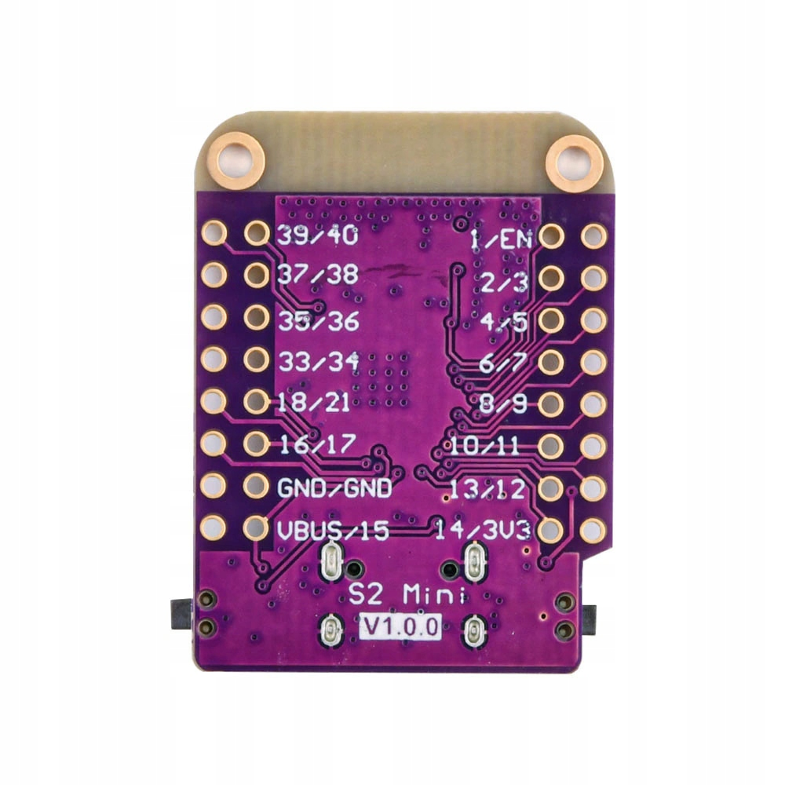

# tRNS

Подробности схемы тут
https://boosty.to/e-kolkhoz/posts/3848057d-d47d-4a71-9d24-98528d1f8744

Требуемые библиотеки:
- U8g2 (для OLED дисплея): установить через Library Manager в Arduino IDE

# Контроллер

Взял ESP32-s2 mini

# ЦАП PCM5102A 

I2S DAC на 32 бита в виде модуля, ожидаю сразу биполярный сигнал на выходе.
https://labkit.ru/html/radio_shm?id=507
На модуле PCM5102A могут быть или могут отсутствовать перемычки. **Перемычки нужны, напаиваем капельки припоя.**

Перемычка H1L в положение L.
Перемычка H2L в положение L.
Перемычка H3L в положение H.
Перемычка H4L в положение L.

| Обозначение | Назначение                              | L (GND)                    | H (VCC)                           |
| ----------- | --------------------------------------- | -------------------------- | --------------------------------- |
| **H1L**     | Audio data format (FMT pin)             | I²S                        | DSP                               |
| **H2L**     | De-emphasis (DEMP pin)                  | Отключено                  | Включено (для CD audio)           |
| **H3L**     | Soft Mute при отсутствии BCK (XSMT pin) | Отключено (звук останется) | Включено (звук замутится)         |
| **H4L**     | Oversampling filter (FLT pin)           | Фильтр с низкой задержкой  | Фильтр с лучшим подавлением шумов |

# ...

