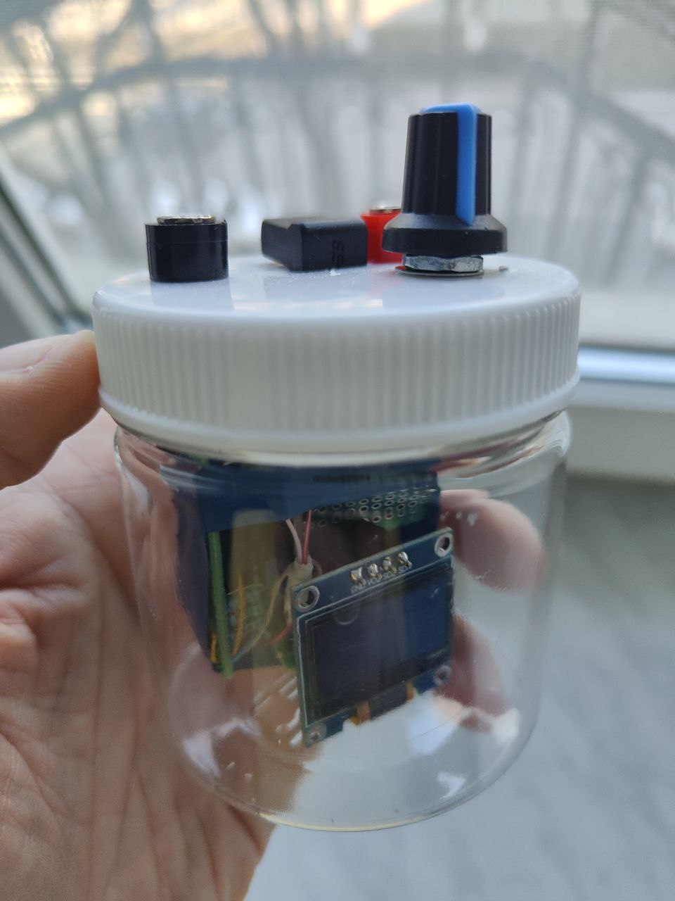

# tRNS

© e-kolkhoz, Apache License 2.0

Требуемые библиотеки:
- U8g2 (для OLED дисплея): установить через Library Manager в Arduino IDE

Авторский разбор проекта на Хабре:
[https://habr.com/ru/articles/981086/](https://habr.com/ru/articles/981086/)

Там - весь контекст: зачем, как, почему именно так и куда это всё движется.

---

## Где лежит реальная практическая часть

Этот репозиторий - **витрина идеи и кода**.
А вот **вся мясная часть**, с которой проект при должном терпении относительно легко воспроизвести:

**Схема, сборка, BOM, грабли и рабочие версии:**
[https://boosty.to/e-kolkhoz/posts/3848057d-d47d-4a71-9d24-98528d1f8744](https://boosty.to/e-kolkhoz/posts/3848057d-d47d-4a71-9d24-98528d1f8744)

Там:

* финальная схема и итерации,
* список компонентов с аналогами,
* что ломается первым и почему,
* как я реально доводил устройство до рабочего состояния, а не в теории.

Если ты:

* умеешь паять,
* хочешь собрать себе tRNS/tES,
* базово знаком со средой Arduino,
* или не особо в этом разбираешься, но хочешь получить почти готовое устройство, тут найдётся формат и для тебя.

## Поддержка проекта

Проект живёт в формате **open hardware + open code**,
но развивается не на энтузиазме вселенной, а на моём времени.

Если тебе нравится такой формат - [https://boosty.to/e-kolkhoz](https://boosty.to/e-kolkhoz)

Подписка = доступ к новым схемам, платам, прошивкам, экспериментам и честным разборам, что сработало, а что нет. На boosty я публикую смежные темы с той же полянки: биокек, разборы публикаций, лонгриды на экзотические темы, DIY и прочие штуки, которые в какой-то степени нас всех интересуют.

## Где я обитаю

Канал про развитие проекта, новые итерации и общий биокек:
[https://t.me/e_kolkhoz](https://t.me/e_kolkhoz)

Личка для вопросов по сборке, идеям:
[https://t.me/ekolkhoz](https://t.me/ekolkhoz)