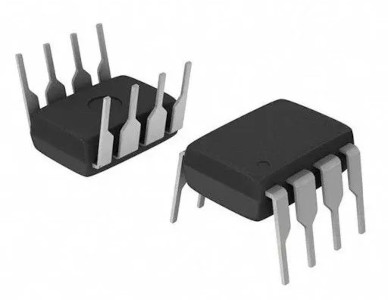

# tRNS
1. **Для чего используется**  
    Это метод стимуляции мозга, при котором на череп подают **случайный шумовой ток** в диапазоне частот (обычно 100-640 Hz). Используется в исследованиях для:
    
    - Улучшения когнитивных функций (память, внимание, обучение)
        
    - Лечения депрессии и тревожности
        
    - Улучшения моторных функций у пациентов с болезнью Паркинсона
        
    - Стимуляции творческого мышления
        
2. **Доказательная база**
    
    - Исследования показывают, что tRNS может **улучшать нейропластичность** и работу коры, особенно если применять его во время когнитивных задач.
        
    - Работает по принципу **субпороговой стимуляции** — клетки не возбуждаются напрямую, но их активность становится более пластичной.
        
    - У пациентов с депрессией и когнитивными нарушениями наблюдаются **долговременные эффекты** после курса процедур.
        
    - Исследования всё ещё идут, и это не панацея. Пока эффекты tRNS не так хорошо подтверждены, как у **tDCS**, но направление перспективное.

* https://www.nature.com/articles/s41598-019-51553-7
* https://www.jneurosci.org/content/28/52/14147
* https://jneuroengrehab.biomedcentral.com/articles/10.1186/s12984-024-01481-z
* https://pmc.ncbi.nlm.nih.gov/articles/PMC8084324/
        
3. **Сложности в реализации**
    
    - **Сложнее, чем tDCS**, потому что нужен **генератор случайного шума** с нужной частотной характеристикой. В простых схемах делают это на **MCU + DAC**, а в сложных — через специализированные схемы.
        
    - **Подбор параметров**: амплитуда обычно 1-2 мА, но важно правильно подобрать частотный спектр.
        
    - **Отсутствие чёткого стандарта**: пока нет 100% «правильных» настроек, многие параметры варьируются от исследования к исследованию.

# Стратегия реализации

Контроллер с помощью ЦАП выдает сигнал с нужными характеристиками, биполярный, гауссовский 100-640Гц, усилитель усиливает чтобы дать мощный вольтаж, способный выдать целевую амплитуду через несколько кОм. Ток проходит в том числе через шунт, на котором замеряется напряжение с помощью АЦП. Если измерения АЦП прямые биполярные, то можно оценить распределение, СКО, амплитуду и спектр сигнала, строго говоря, достаточно получить униполярню огибающую, чтобы прям на цифре контролировать амплитуду, но мне хочется сначала сделать побольше контроля и оцифровывать всё полностью, рисовать на OLED спектр, распределение, СКО (три сигмы) и амплитуду.

Сигнал с заранее заданными характеристиками (в виде луп-фрагмента на пару секунд) генерится с помощью питоньего блокнота в samples_generator. Контроллер просто будет его проигрывать по кругу из буфера и контролировать амплитуду по обратной связи через АЦП.

# Контроллер

Взял ESP-WROOM-32
Раз уж хотчется на лету считать FFT для спектра и хранить сэмплы на контроллере, то нужно достаточно flash и оперативной памяти (**520 КБ RAM** ).

# ЦАП PCM5102A 

I2S DAC на 32 бита в виде модуля, ожидаю сразу биполярный сигнал на выходе.
https://labkit.ru/html/radio_shm?id=507
На модуле PCM5102A могут быть или могут отсутствовать перемычки. **Перемычки нужны, напаиваем капельки припоя.**

Перемычка H1L в положение L.
Перемычка H2L в положение L.
Перемычка H3L в положение H.
Перемычка H4L в положение L.

| Обозначение | Назначение                              | L (GND)                    | H (VCC)                           |
| ----------- | --------------------------------------- | -------------------------- | --------------------------------- |
| **H1L**     | Audio data format (FMT pin)             | I²S                        | DSP                               |
| **H2L**     | De-emphasis (DEMP pin)                  | Отключено                  | Включено (для CD audio)           |
| **H3L**     | Soft Mute при отсутствии BCK (XSMT pin) | Отключено (звук останется) | Включено (звук замутится)         |
| **H4L**     | Oversampling filter (FLT pin)           | Фильтр с низкой задержкой  | Фильтр с лучшим подавлением шумов |
# АЦП ADS1115

Модуль 16bit ADC в компактном исполнении.
Очевидный способ оценить характеристики тока, идущего через мозг - практически прямые измерения через шунтирующее сопротивление. Ставим 100Ом и мерим на нем напряжение, прямо пропорциональное току без существенных линейных и нелинейных искажений, а это напряжение мы АЦПом из захватим и проанализируем на контроллере.

# Усилитель OPA134PA + E0515S-1WR3 или DPU01L-12 или MEA1D0512SC 

Самая аналоговая часть устройства.
OPA134 - моно усилитель в виде чипа с ногами, для которого нужны:
* Он сам и дырчатая макетная плата.
* 2-е штуки повышающие DC-DC CKCS BS01  (клон MT3608) надо запаять выходной джампер, чтоб видно было по светодиоду, хорошо ли он себя чувствует, а так же надо запаять джамперы, которые отвечают за выходное напряжение, там схема на обратной стороне нарисована, делаем 9V. На одном заземляем плюс, на другом минус НА ВЫХОДЕ, получаем для усилка +9V и -9V (что не заземлено, то на усилок). Чип может греться, пусть дышит, двухсторонний скотч на него не лепим.
* Резистор 3296W-1-103, чтобы выставить фиксированное усиление, потому что стабилизацию будем делать в цифровой части, просто меньший или больший сигнал будем на входе усилка давать.

